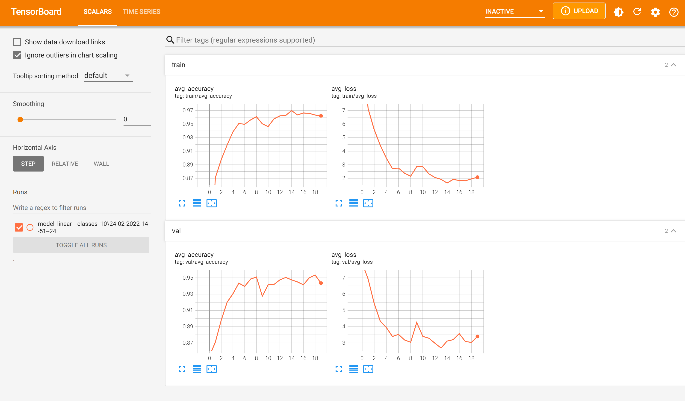

# AST classification
A ML classification task where input consists of simplified AST representations of python programs

## Dataset

The dataset is in `data`. It has been collected, processed, anonymized and filtered  from [this Codeforces dataset](https://mega.nz/folder/Sypi0BrS#iNbQXf3EwcjZbpwXRKHOnQ/folder/z2R01BQJ). More information about the dataset is available [here](https://codeforces.com/blog/entry/94755). Code for creating my sub-dataset is in `util`.

The dataset consists of simplified ASTs of ~400000 short python programs grouped into 104 classes. The programs in one class are accepted Python submissions for one particular Codeforces task. I have removed information about all identifiers. The line `x = ['elem1', 'elem2']` is represented as 

```python
    [('Assign', [('Name', ['Store']), ('List', ['Constant', 'Constant', 'Load'])])]
```

[data/data_statistics.txt](data/data_statistics.txt) contains dataset statistics. Decimal quantiles for lines, tokens and maximal tree depths are: (TODO(aleloi): add plots)

    num lines stats: [4.0, 6.0, 7.0, 8.0, 10.0, 11.0, 13.0, 16.0, 21.0]
    num tokens stats: [36.0, 47.0, 57.0, 65.0, 73.0, 82.0, 94.0, 112.0, 146.0]
    depth stats: [7.0, 7.0, 8.0, 8.0, 9.0, 9.0, 10.0, 10.0, 11.0]


## Tree-LSTM vs Tree-Based CNN

The goal of this project is to compare the performance of [Tree-LSTM](https://arxiv.org/abs/1503.00075) to [Tree-based CNN](https://arxiv.org/abs/1409.5718). I only plan to implement Tree-LSTM, and compare with the TBCNN performance on a simimilar classification task described in the TBCNN article.

This is primarily an education project for training neural networks to take ASTs as input.

## First results


I tested training the simplest possible model: flatten the AST, embed
the tokens in 20-dim space, and process the resulting sequence by a
normal linear LSTM.

```
LinearLSTM(
  (embedding): Embedding(88, 20, padding_idx=87)
  (lstm): LSTM(20, 20)
  (linear): Linear(in_features=20, out_features=10, bias=True)
  (loss): CrossEntropyLoss()
)
```

This results in 95% accuracy when trained on a subset of the data
(1000 solutions per class with 10 classes). I first tried with Adam
with default parameters and learning rate `0.01` and training seems to
have worked.

## TODO
* Do some analysis of the resulting embedding: which nodes are
  closest, are there clusters? I expect `For, While` to be close.
  `Break, Continue` should also be a group.
* Write TreeLSTM
* Extract some interesting metrics: between which tokens does the LSTM
  forget? 
* Check whether training is faster if we initialize embedding and LSTM
  weights from a pre-trained model with fewer classes.
