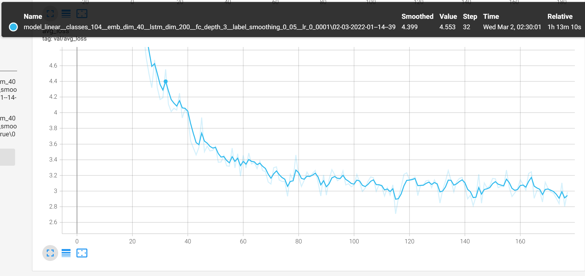
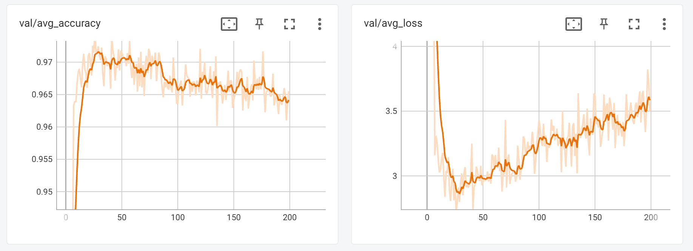
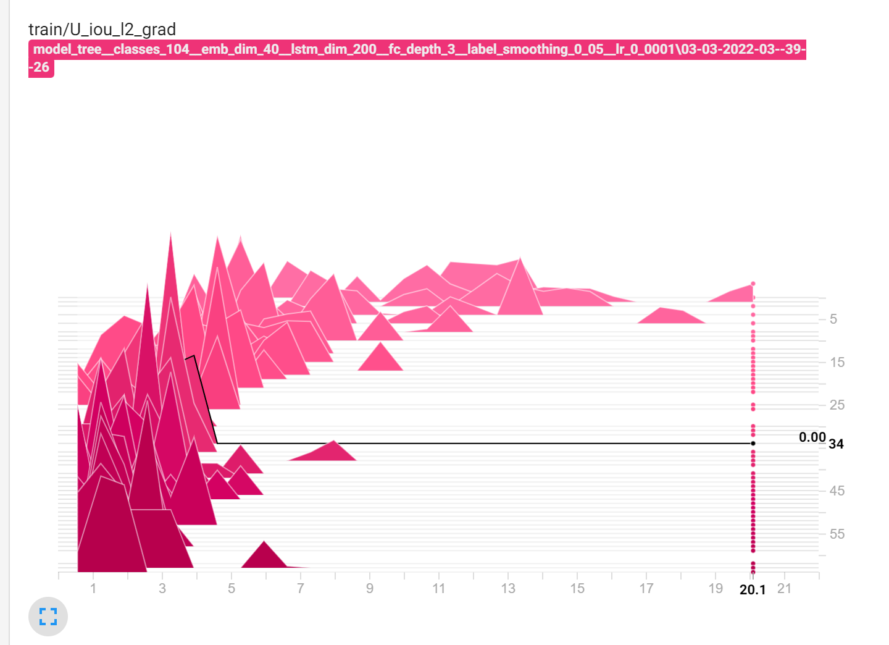

# AST classification
A ML classification task where input consists of simplified AST representations of python programs

## Dataset

The dataset is in `data`. It has been collected, processed, anonymized and filtered  from [this Codeforces dataset](https://mega.nz/folder/Sypi0BrS#iNbQXf3EwcjZbpwXRKHOnQ/folder/z2R01BQJ). More information about the dataset is available [here](https://codeforces.com/blog/entry/94755). Code for creating my sub-dataset is in `util`.

The dataset consists of simplified ASTs of ~400000 short python programs grouped into 104 classes. The programs in one class are accepted Python submissions for one particular Codeforces task. I have removed information about all identifiers. The line `x = ['elem1', 'elem2']` is represented as 

```python
    [('Assign', [('Name', ['Store']), ('List', ['Constant', 'Constant', 'Load'])])]
```

[data/data_statistics.txt](data/data_statistics.txt) contains dataset statistics. Decimal quantiles for lines, tokens and maximal tree depths are: (TODO(aleloi): add plots)

    num lines stats: [4.0, 6.0, 7.0, 8.0, 10.0, 11.0, 13.0, 16.0, 21.0]
    num tokens stats: [36.0, 47.0, 57.0, 65.0, 73.0, 82.0, 94.0, 112.0, 146.0]
    depth stats: [7.0, 7.0, 8.0, 8.0, 9.0, 9.0, 10.0, 10.0, 11.0]
	
Some ASTs are very large because some solutions start with a long template. Initially I filtered out the longest 1% of the data. Modify [dataset.DataArgs.drop_large_threshold_tokens](dataset.py#L193) to change this.

Two classes in the dataset correspond to the same problem. It appears twice on Codeforces, as [codeforces.com/contest/1465/problem/A](https://codeforces.com/contest/1465/problem/A) and as [codeforces.com/contest/1411/problem/A](https://codeforces.com/contest/1411/problem/A). Since I noticed this quite late in development, there is a hack in [dataset.py](dataset.py) that manually assigns both these problems the same label. Otherwise, the labels would be permuted, and that hinders evaluation of saved models.

The dataset contains plenty of duplicate ASTs. As stated above, there are ~400k ASTs, but only ~200k unique ASTs. There is a version of the dataset without duplicates in `data/cont*_prob*.txt.uniq.txt`.

The solution distribution in the dataset is pretty inhomogeneous. The most common problems have ~20k solutions, and the least common has ~1000. I want to compare results to [Tree-based CNN](https://arxiv.org/abs/1409.5718), which had exactly 500 problems per class. To ensure a uniform prior over problem class, I first randomly split the dataset, and then use weighted sampling. One epoch draws `500*num_classes` samples from the training split. Check [train\_dgl.py](train_dgl.py#L21) for dataset options.


## Tree-LSTM vs Tree-Based CNN

The goal of this project is to compare the performance of [Tree-LSTM](https://arxiv.org/abs/1503.00075) to [Tree-based CNN](https://arxiv.org/abs/1409.5718). I only plan to implement Tree-LSTM, and compare with the TBCNN performance on a simimilar classification task to the one described in the TBCNN article.

This is primarily an education project for training neural networks to take ASTs as input.

## Results
I got 97.2% accuracy on my 104 problems dataset with ordinary LSTM
(*TODO eval on test set at epoch 28*) and ??% accuracy with
TreeLSTM. Training the TreeLSTM took about a day on a laptop. Training
speed was ~30 samples per second for TreeLSTM and about 400 samples
per second for LSTM. I used Adam momentums $(0.9, 0.999)$ (Pytorch
default), and learning rate 0.0001. 

With the original dataset, I do not observe any overfitting. The
dataset contains duplicate entries that end up in both validation and
training set. This reduces observed overfitting, because we in part
evaluate on the training set. It also contains two identical
problems. After ca epoch 100 and 3-4 hours of training, misclassified
training samples are almost entirely composed of the duplicate
problem. This makes the network see relatively large gradients every
100 samples, which I think has a slight regularizing effect.




When duplicate solutions are removed, and the two duplicate problems
are merged I got 97.2% accuracy (*TODO eval on test set at epoch 28*)
on the 103 remaining classes with linear LSTM. This it does start
overfitting pretty fast. I did not include any regularization because
I discovered the overfitting quite late and because [the Tree-based
CNN article](https://arxiv.org/abs/1409.5718) says that they found that no
regularization worked best for RNN models.



### Tree-LSTM
I made a simple Pytorch Tree-LSTM implementation by following
equations (2-8) in the [Tree-Structured Long Short-Term
Memory](https://arxiv.org/pdf/1503.00075.pdf) article. It managed to
train at ~16 samples per second on CPU. I managed to push it up to 22
samples/second. Training on GPU was even slower at 5 samples/s. I then
adapted an LSTM implementation from the [Deep Graph
Network](https://www.dgl.ai/) examples repository which now runs at 40
samples/s. This is ca 10 times slower than the linear LSTM speed.

```
DGLTreeLSTM(
  (embedding): Embedding(88, 40, padding_idx=87)
  (lstm_cell): ChildSumTreeLSTMCell(
    (W_iou): Linear(in_features=40, out_features=600, bias=False)
    (U_iou): Linear(in_features=200, out_features=600, bias=False)
    (U_f): Linear(in_features=200, out_features=200, bias=True)
  )
  (fc_layers): Sequential(
    (0): Linear(in_features=200, out_features=200, bias=True)
    (1): Tanh()
    (2): Linear(in_features=200, out_features=104, bias=True)
  )
  (loss): CrossEntropyLoss()
  (train_loss): CrossEntropyLoss()
)
```

Tree-LSTMs train much faster when measured in samples processed. They
also produce a better results.

`TODO image when reduped dataset run finishes`

## Run the model
To run you need `python >= 3.9` and `cuda 11.3`. Run `pip install -r
requirements.txt`. Python `3.9` is required because I used
`argparse.BooleanOptionalAction` which is a 3.9 feature. Cuda 11.3 is
required because the `pytorch` and `dgl` versions in
`requirements.txt` say so. I think I haven't hard-coded running on
GPU, so a cuda-less `dgl` and `pytorch` probably also work, but I
haven't tested.

There is a runner script with far too many arguments. One can point it
to a python file and ask it to predict which codeforses task it
solves. I've included a saved model, so this should work after installing
the dependencies:

```
python main.py --mode predict \
   --saved_model_dir \
   ./results/model_linear__classes_104__emb_dim_40__lstm_dim_200__fc_depth_3__label_smoothing_0_05__lr_0_002__prune_uniq_True \
   --predict_path ./data/my/1454_D.py
```

This currently outputs
```
Using device [cuda].
Loading model from ./results/model_linear__classes_104__emb_dim_40__lstm_dim_200__fc_depth_3__label_smoothing_0_05__lr_0_002__prune_uniq_True...
./results/model_linear__classes_104__emb_dim_40__lstm_dim_200__fc_depth_3__label_smoothing_0_05__lr_0_002__prune_uniq_True contains runs 04-03-2022-21--21--08
Latest run is: 04-03-2022-21--21--08
Loading epoch: Epoch--199-Loss--3.50.pt out of 200 epochs
Missing/unexpected: <All keys matched successfully>

P=0.951, problem=1454D
P=0.001, problem=467A
P=0.001, problem=271A
```

## Tensorboard
I am logging training curves, gradient values, gradient norms, weight
values and the token embeddings to Tensorboard. 

The `--small_train_samples` argument specifies how many samples of the
training set are used after each epoch to estimate average gradient
values and norms. The idea is to have the same sample distribution as the training data, so I use a smaller subset of training samples and the same batch size. For every weight matrix and bias vector $w$, I make a histogram of all 

for all the batches. The result may look like this:



The figure shows that gradient norms slowly decrease as training
progresses. This is a useful debugging tool: before I added label
smoothing, gradients increase instead of decreasing.

To see the graphs, run `python -m tensorboard.main --logdir=results/`
and open [http://localhost:6006](http://localhost:6006) once it has
processed the data. I checked in some saved tensorboard data together
with the trained LSTM model (although that may not have any histograms).

## TODO
* Do some analysis of the resulting embedding: which nodes are
  closest, are there clusters? I expect `For, While` to be close.
  `Break, Continue` should also be a group.
* Write TreeLSTM
* Extract some interesting metrics: between which tokens does the LSTM
  forget? 
* Check whether training is faster if we initialize embedding and LSTM
  weights from a pre-trained model with fewer classes.
